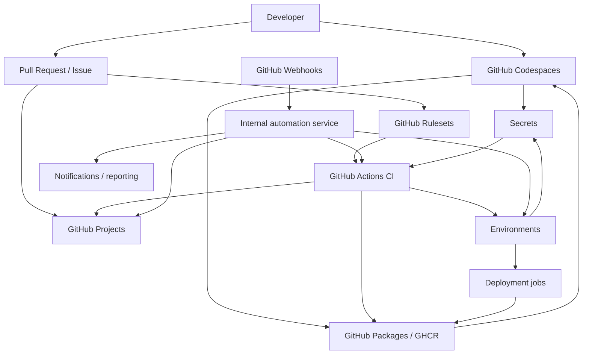

# CTO Technical Integration Plan: Free GitHub Features

Issue: #2  
Repository: `jagmstar/github-features-audit`  
Prepared by: CTO track for JAGM IT Company

## 1) Executive summary

We will use GitHub as the operating system for engineering: GitHub Actions for automation, GitHub Projects for planning, Codespaces for standardized development environments, GitHub Packages / GHCR for build artifacts and container images, Environments + Secrets for release control, Rulesets for policy enforcement, and Webhooks for event-driven integration.

The current repository already has a lightweight GitHub Actions CI workflow that validates deliverables under `docs/`. This plan extends that baseline into a full delivery architecture rather than replacing it.

## 2) Baseline and assumptions

### Current baseline
- Repository is private and hosted on GitHub.
- Default branch is `main`.
- Existing automation is centered on `.github/workflows/ci.yml`.
- The repo is documentation-heavy today, but the target architecture should support code, docs, releases, and operational automation.

### Assumptions
- GitHub-hosted runners are sufficient for most jobs.
- We will prefer GitHub-native integrations before introducing external tooling.
- If a GitHub Free/private-repo limitation blocks a capability, we either:
  1. move that capability to a repo/organization level that supports it, or
  2. treat it as a controlled upgrade path and document the dependency explicitly.
- Any deployment or package publication workflow will use least-privilege credentials and short-lived access where possible.

## 3) Architectural principles

1. **Policy before merge**: rulesets and required checks must stop unsafe changes before they reach `main`.
2. **Automation before manual work**: Actions and webhooks should update Projects, publish artifacts, and manage release flows automatically.
3. **Secrets are scoped, not shared globally**: use repo, environment, or organization scope only where needed.
4. **Standardize the developer experience**: use Codespaces and dev containers to make local setup reproducible.
5. **Immutable artifacts**: publish versioned, digest-pinned packages/images.
6. **Event-driven integration**: webhooks should feed internal automation instead of polling.

## 4) Feature-by-feature integration plan

### 4.1 GitHub Actions

**Role in the architecture**
- Primary automation engine for CI, docs validation, project sync, release packaging, and deployment orchestration.

**Integration plan**
- Keep the existing `ci.yml` as the base quality gate for the repo.
- Add dedicated workflows for:
  - `ci.yml` — lint, test, and docs validation.
  - `project-sync.yml` — sync issue labels, statuses, and project fields.
  - `release.yml` — build and publish container images/packages to GHCR.
  - `deploy.yml` — deploy to the target environment after checks and approvals pass.
  - `webhook-handler.yml` or an external service trigger — react to important repository events.
- Set workflow permissions to the minimum required for each job.
  - Example: `contents: read` for validation jobs.
  - Example: `issues: write` and `projects: write` for project automation.
  - Example: `packages: write` for package publication.
  - Example: `deployments: write` for environment-aware deployments.
  - Example: `id-token: write` only when OIDC is used.
- Use concurrency groups for deployment workflows so only one deployment to the same environment can run at a time.
- Prefer reusable workflows for repeated patterns across the company’s future repositories.

**Implementation details**
- Trigger CI on `push` and `pull_request` to `main` and release branches.
- Use path filters so docs-only changes do not run expensive build jobs unless needed.
- Use workflow artifacts for temporary build outputs; use Packages for durable release assets.
- Use workflow_run or repository_dispatch only when a downstream workflow truly depends on a completed upstream workflow.

**Success criteria**
- Every merge to `main` is validated automatically.
- Package publication is repeatable and traceable.
- Deployments are gated by environment rules rather than by human memory.

### 4.2 GitHub Projects

**Role in the architecture**
- Single source of truth for planning, sprint tracking, and cross-role coordination.

**Integration plan**
- Create an organization-level project such as `JAGM Free Features Delivery`.
- Use a standard field model:
  - `Status` (Todo / In Progress / In Review / Done)
  - `Priority` (P0 / P1 / P2)
  - `Iteration` for sprint planning
  - `Estimate` for effort sizing
  - `Feature Area` (Actions / Projects / Codespaces / Packages / Environments / Rulesets / Webhooks)
  - `Owner` and `Risk`
- Create at least three views:
  - **Board** for sprint execution
  - **Table** for backlog management
  - **Roadmap** for release sequencing
- Configure built-in automations:
  - auto-add issues by label or repository filter
  - auto-set Status when items are added
  - auto-archive completed work after release windows
- Use GitHub Actions to keep project fields in sync with issue labels, PR merges, and deployment status.

**Implementation details**
- Each issue becomes a project item.
- Each deliverable doc or code change should map to a project item so leadership can see progress without reading the entire repo.
- Use project insights to show throughput, overdue items, and feature completion rate.

**Success criteria**
- Every issue in the program is visible in a single board.
- Sprint scope can be changed without changing the source-of-truth issue list.
- Leadership can read status from the project instead of asking for manual updates.

### 4.3 GitHub Codespaces

**Role in the architecture**
- Standardized, cloud-hosted developer workstation for all contributors.

**Integration plan**
- Add a `.devcontainer/` configuration that represents the real project toolchain.
- Include:
  - language runtime(s)
  - formatter/linter tooling
  - GitHub CLI
  - any package manager the team uses
- Define recommended secrets only when a developer workflow actually requires them.
- Enable prebuilds for the main development branch if repository size or dependency installation time justifies it.
- Use a consistent Codespaces image for issue triage, docs updates, workflow editing, and future feature development.

**Implementation details**
- Use a devcontainer rather than personal machine setup for anything that should be reproducible.
- Keep the devcontainer focused on shared tools, not personal preferences.
- If the project later needs private-registry access, configure it explicitly so Codespaces can reach GHCR or other approved registries.

**Success criteria**
- A new contributor can open the repo and start working with minimal setup.
- Local environment drift is reduced.
- Tooling versions are consistent across the team.

### 4.4 GitHub Packages / Container Registry (GHCR)

**Role in the architecture**
- Durable artifact and image distribution layer.

**Integration plan**
- Use GHCR as the default registry for internal container images and release artifacts that need a stable versioned home.
- Publish images from GitHub Actions using `GITHUB_TOKEN` where possible.
- Attach OCI metadata labels such as source repository, description, and license.
- Use digest-pinned pulls for deployments to avoid tag drift.
- Keep large ephemeral build outputs in Actions artifacts; keep long-lived build/runtime artifacts in GHCR.

**Implementation details**
- Add a release workflow that:
  1. builds the image/package
  2. runs validation
  3. tags the artifact with a version and `latest` only when appropriate
  4. publishes to GHCR
- Connect packages to the repository so permissions inherit correctly.
- If the repo grows into a multi-service platform, use separate package namespaces per service.

**Success criteria**
- Every release artifact is traceable back to a commit.
- Deployment and Codespaces base images can consume the same published artifact.
- Artifact provenance is visible in GitHub.

### 4.5 GitHub Environments + Secrets

**Role in the architecture**
- Promotion control for deployments and scoped secret management.

**Integration plan**
- Define environments such as:
  - `development`
  - `staging`
  - `production`
- Add deployment protection rules:
  - required reviewers for higher-risk environments
  - branch restrictions for deployable refs
  - optional wait timer for production
- Store environment-specific secrets only in the environment that needs them.
- Use environment variables for non-secret settings that differ by deployment target.
- Use GitHub Actions jobs that reference the target environment so the environment rules are enforced automatically.

**Implementation details**
- CI jobs that need scoped secrets but do not represent a real deployment can use environment references carefully; if deployment tracking is not desired, opt out only when compatible with the environment rules.
- Deployment jobs should wait for environment approvals before touching protected systems.
- Keep the production secret surface area as small as possible.
- Prefer short-lived credentials and OIDC for external cloud providers when that becomes relevant.

**Plan constraint for this private repo**
- GitHub documentation shows that some environment-secret and reviewer capabilities are plan-dependent for private repositories.
- If the organization remains on a plan that does not support a given private-repo environment capability, we will either upgrade the plan or keep that capability in a repo layout that supports it.

**Success criteria**
- No production deployment happens without the right approvals.
- Secrets are only visible to jobs that truly need them.
- Environment names map cleanly to release stages.

### 4.6 GitHub Rulesets

**Role in the architecture**
- Repository policy engine for branch safety and release discipline.

**Integration plan**
- Create rulesets for `main` and any release branches.
- Require:
  - pull requests before merging
  - status checks to pass before merging
  - linear history
  - signed commits where practical
  - blocked force pushes
- Require deployments to succeed before merging when a branch must not advance unless staging/prod gates are satisfied.
- Use bypass permissions sparingly and only for trusted admin or release roles.

**Implementation details**
- Start with evaluate/dry-run behavior if available in the rollout process.
- Layer rulesets with any existing branch protection rules rather than replacing them in one step.
- Use different ruleset patterns for default branch vs release branches.

**Success criteria**
- Unsafe pushes cannot land on protected branches.
- The branch policy itself is visible and auditable.
- Release branches enforce stricter merge behavior than feature branches.

### 4.7 GitHub Webhooks

**Role in the architecture**
- Event bus for internal automation and integrations.

**Integration plan**
- Subscribe only to events that drive real automation:
  - `issues`
  - `issue_comment`
  - `pull_request`
  - `projects_v2` / `projects_v2_item` where applicable
  - `package`
  - `deployment`
  - `deployment_status`
  - `deployment_protection_rule` if custom deployment approvals are introduced
  - `workflow_run` for downstream orchestration
- Deliver webhook payloads to an internal automation service or serverless endpoint.
- Validate every webhook with the GitHub signature header.
- Make handlers idempotent using the delivery GUID and event/action tuple.
- Use webhooks to:
  - update Projects automatically
  - notify stakeholders of deployment state changes
  - trigger downstream compliance or reporting jobs

**Implementation details**
- Avoid using webhooks as a replacement for checks that can be done directly in Actions.
- Treat webhook failures as retryable, but keep side effects idempotent.
- Log and monitor failed deliveries so the automation service does not silently drift.

**Success criteria**
- Project status updates and deployment notifications happen automatically.
- GitHub events can feed internal tools without polling.
- Webhook consumers are secure and observable.

## 5) Dependency graph

### Dependency notes
- **Rulesets** are upstream of everything that lands on protected branches.
- **Actions** is the execution plane for CI, publication, and deployments.
- **Environments** depend on Actions for deployment objects and on Secrets for gated access.
- **Projects** depends on issues/PRs and gets enriched by Actions and webhooks.
- **Codespaces** depends on repo configuration and optionally GHCR for custom images.
- **Webhooks** are event-driven inputs to the internal automation layer.

## 6) Migration steps

### Phase 0 — Audit and inventory
- Inventory current branches, workflows, secrets, and any existing release path.
- List the feature areas that need to be managed in Projects.
- Identify which jobs are build-only, deploy-only, and secret-dependent.

### Phase 1 — Foundation
- Add or finalize the Codespaces devcontainer.
- Define the first GitHub Project with standard fields and views.
- Create initial environment names and assign any existing secrets to the correct scope.
- Establish rulesets for `main` with at least PR + required checks + block force pushes.

### Phase 2 — CI and automation
- Split the current workflow into reusable CI and automation workflows if needed.
- Add workflow permissions explicitly.
- Add project-sync automation for issue state changes.
- Add webhook consumers for important repo events.

### Phase 3 — Artifact and release path
- Publish build outputs to GHCR.
- Add deployment jobs that target `staging` and `production` environments.
- Require deployments to pass before merge for protected release branches.
- Switch consumers to digest-pinned image references.

### Phase 4 — Hardening
- Turn on stricter ruleset enforcement across protected branches.
- Add reviewer requirements and environment branch restrictions.
- Rotate secrets and remove unused credentials.
- Document operational ownership and rollback steps.

## 7) Risk assessment

| Risk | Impact | Likelihood | Mitigation |
| --- | --- | --- | --- |
| Private-repo plan limits block some free feature capabilities | Medium to high | Medium | Treat plan constraints explicitly; upgrade if needed or shift the affected capability to a supported repo/plan layout. |
| Rulesets block legitimate merges during rollout | High | Medium | Roll out in phases, start with evaluation/dry-run when possible, and keep a narrowly scoped bypass list. |
| Secret leakage through logs or overbroad permissions | High | Medium | Use least privilege, environment scoping, secret masking, and short-lived credentials where possible. |
| Webhook retries or duplicates create inconsistent state | Medium | Medium | Use idempotency keys, signature validation, and durable processing records. |
| Codespaces configuration drifts from CI/runtime reality | Medium | Medium | Make the devcontainer the canonical environment and keep CI aligned with it. |
| GHCR artifacts drift because of mutable tags | High | Medium | Promote by version and digest, not by `latest` alone. |
| Environment gates slow releases too much | Medium | Low | Use reviewer SLAs, concurrency controls, and stage-specific protection rules. |
| Project automation becomes noisy or stale | Low to medium | Medium | Automate only the fields that add real value and archive completed items consistently. |

## 8) Operating model

### Ownership
- CTO: architecture, policy, and platform design.
- DevOps: Actions, environments, GHCR, and deployment workflows.
- PMO: Projects structure and reporting.
- CISO: rulesets, secrets policy, and review controls.
- Engineering: Codespaces setup and workflow implementation.

### Minimum operating standards
- Every new workflow must declare permissions explicitly.
- Every deployable branch must be protected by rulesets.
- Every secret must have an owner and a scope.
- Every package/image must be traceable to a commit.
- Every major repo event should either update Projects or be intentionally ignored.

## 9) Research basis

Official GitHub documentation reviewed for this plan:
- GitHub Actions workflow syntax and workflow triggers: https://docs.github.com/actions/using-workflows/workflow-syntax-for-github-actions
- GitHub Actions secrets: https://docs.github.com/en/actions/concepts/security/secrets
- Managing environments for deployment: https://docs.github.com/actions/deployment/targeting-different-environments/using-environments-for-deployment
- Deployments and environments: https://docs.github.com/en/actions/reference/workflows-and-actions/deployments-and-environments
- GitHub Projects overview and automation: https://docs.github.com/en/issues/planning-and-tracking-with-projects
- GitHub Codespaces and dev containers: https://docs.github.com/en/codespaces and https://docs.github.com/codespaces/setting-up-your-project-for-codespaces/introduction-to-dev-containers
- GitHub Packages / Container registry: https://docs.github.com/en/packages and https://docs.github.com/packages/working-with-a-github-packages-registry/working-with-the-container-registry
- GitHub Rulesets: https://docs.github.com/en/repositories/configuring-branches-and-merges-in-your-repository/managing-rulesets/about-rulesets and https://docs.github.com/en/repositories/configuring-branches-and-merges-in-your-repository/managing-rulesets/available-rules-for-rulesets
- GitHub Webhooks: https://docs.github.com/en/webhooks/webhook-events-and-payloads

## 10) Recommended next actions

1. Approve the target-state scope for private-repo plan constraints.
2. Create the `Projects` board and standard field model.
3. Add the Codespaces devcontainer.
4. Introduce rulesets on `main`.
5. Split CI, release, and automation into separate workflows.
6. Start publishing runtime artifacts to GHCR.
7. Add webhook-driven project/status automation.
